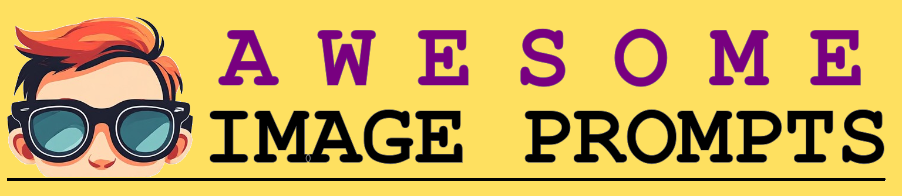
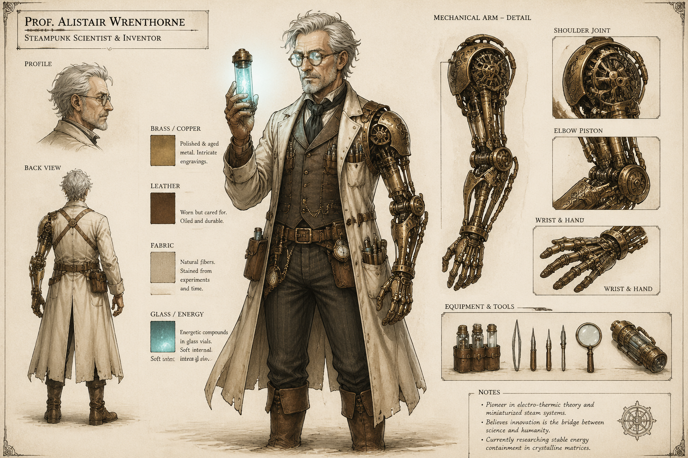
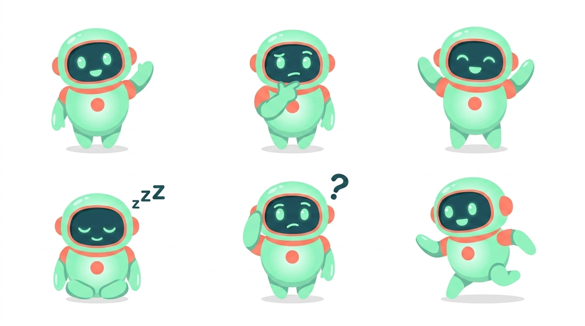
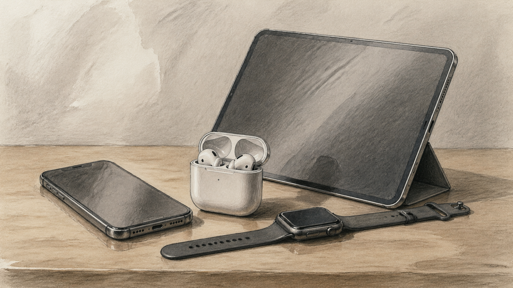
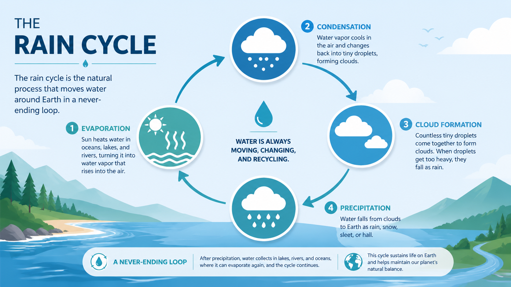
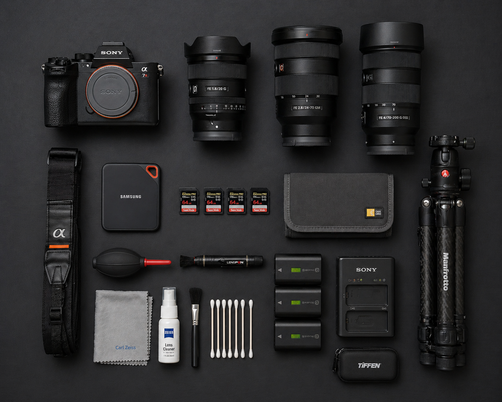
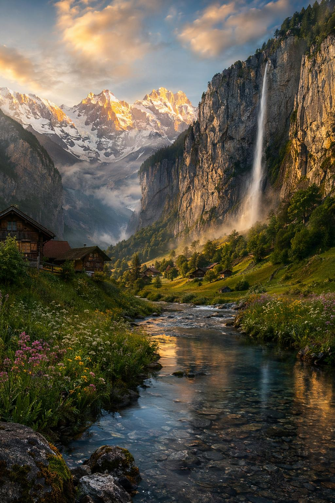
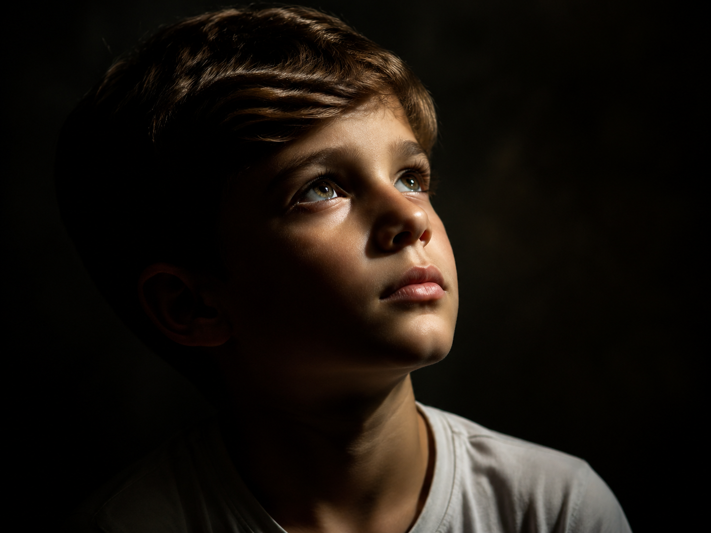

# Awesome Image Prompts

[](https://awesome.re)
[](https://www.apache.org/licenses/LICENSE-2.0)
[](https://github.com/tejasashinde/awesome-image-prompts/stargazers)

<p align="center">
    
</p>

A curated, community-driven collection of prompts for image generation models. This repository organizes prompts by category and aims to build a structured and reliable image prompt library that keeps them reusable and easy to explore.

---

## 📁 Repository Structure

```
categories/
  ├── character.md
  ├── grid.md
  ├── illustration-painting.md
  ├── infographics-typography.md
  ├── mockups.md
  ├── nature-landscapes.md
  └── portraits.md
```

Each file inside `categories/` contains prompts grouped by use case and model type.

---

## ✨ Features

- High-quality image generation prompts  
- Organized by category (portraits, mockups, etc.)  
- Model-specific prompt sections (Midjourney V8, GPT Image 2, etc.) 
- Source links for verification and inspiration  
- Strictly **Safe For Work (SFW)** prompts only  

---

## 📚 Prompt Categories

> 📌 **NOTE:** All prompts and images featured in this README are original works by [@tejasashinde](https://github.com/tejasashinde). Category files include prompts contributed by the community, with appropriate source attribution where applicable.

The following image categories are included:

### 1. **[`Character`](./categories/character.md)** – Character Design prompts
#### Steampunk Scientist Inventor Character


#### **Prompt:**
```
A character concept for a steampunk scientist inventor: an elderly man with a thoughtful expression, slightly wiry build, and neatly combed but slightly unkempt white hair. He wears round brass-rimmed spectacles with faint reflections, and a worn long lab coat layered over a leather utility vest filled with small tools, vials, and mechanical instruments. One arm is a refined mechanical prosthetic with elegant gears, pistons, and engraved brass detailing, designed with precision rather than rough construction.
```

---

### 2. **[`Grid`](./categories/grid.md)** – Grid style prompts
#### Cute AI Mascot with 6 poses


#### **Prompt:**
```
Cute AI mascot character design of a round, friendly artificial intelligence avatar with a softly glowing core, smooth minimal features, and large expressive digital eyes. Color scheme: mint green body with coral accents. Shown in 6 different poses: waving, thinking, celebrating, sleeping, confused, and running. Flat vector style with simple shading, suitable for app icons and stickers.
```

---

### 3. **[`Illustration and Painting`](./categories/illustration-painting.md)** – Creative digital art prompts  
#### Infographic Poster Explaining Rain Cycle


#### **Prompt:**
```
Traditional still-life composition of modern electronic gadgets arranged on a simple table, similar to an art school drawing exam setup. The arrangement includes a smartphone, a pair of wireless earbuds in an open charging case, a smartwatch placed flat beside it, and a tablet slightly tilted against a small stand. The objects are carefully positioned for balanced composition, with overlapping forms and clear perspective. Soft directional studio lighting from one side creates gentle shadows and highlights, emphasizing shapes, edges, and reflections.
The background is plain and uncluttered, like a studio backdrop or classroom wall, with subtle tonal variation. The surface of the table is simple wood or neutral matte texture.
Style: hand-drawn pencil sketch with light watercolor shading or soft gouache wash. Focus on realism, proportion, and observation of form—like a school still-life drawing exercise. Clean linework, minimal color palette, and emphasis on structure, volume, and light-shadow study. No branding, no text, no people.
```

---

### 4. **[`Infographics and Typography`](./categories/infographics-typography.md)** – Design-focused layout prompts  
#### Infographic Poster Explaining Rain Cycle


#### **Prompt:**
```
A flat-design info-graphic poster explaining the rain cycle. Clean iconographic illustrations show evaporation, condensation, cloud formation, and rainfall (precipitation), with curved arrows connecting each stage. Soft blue and teal colour scheme with white icons and text. Modern sans-serif typography, balanced layout with plenty of white space. Educational yet visually appealing.
```

---

### 5. **[`Mockups`](./categories/mockups.md)** – Product and UI presentation prompts
#### Knolling-style Flat-lay Arrangement of Professional Camera Gear


#### **Prompt:**
```
A knolling-style flat-lay arrangement of professional camera gear organized inside a photography field kit setup on a matte black surface. Items arranged in a precise grid: mirror-less camera body, interchangeable lenses, SD cards, portable SSD, lens cleaning kit, camera batteries, memory card case, compact tripod, and a camera strap. Everything aligned at perfect 90-degree angles with equal spacing, resembling a professional gear packing layout. Soft overhead diffused lighting, no harsh shadows, emphasizing a clean, functional, and production-ready photography workflow
```

---

### 6. **[`Nature and Landscapes`](./categories/nature-landscapes.md)** – Scenic and environment-focused prompts
#### Swiss Alps at Sunrise


#### **Prompt:**
```
A breathtaking ultra-photorealistic landscape of the Swiss Alps at sunrise, inspired by the Lauterbrunnen Valley in Switzerland. Towering snow-capped mountains rise dramatically in the background, with sharp jagged peaks glowing golden as the first rays of sunlight hit them. A lush green valley stretches below, filled with vibrant alpine meadows dotted with wildflowers in soft pink, yellow, and purple hues. A narrow crystal-clear river winds through the valley, reflecting the warm sunrise colors and surrounding cliffs like a mirror.

In the mid-ground, a small traditional Swiss wooden village with chalets sits peacefully on a hillside, with smoke gently rising from chimneys, suggesting warmth and life. A tall waterfall cascades down a sheer cliff face in the distance, creating mist that catches the sunlight and forms subtle rainbows.

The atmosphere is calm, serene, and majestic, with soft morning fog drifting through the valley. The lighting is cinematic golden hour lighting with volumetric sun rays breaking through clouds. Ultra-detailed textures on rocks, grass, wood, and water. Natural color grading, highly realistic shadows, and depth.

Shot as if captured on a high-end full-frame DSLR camera with a 35mm lens, f/8 aperture, ISO 100, ultra-sharp focus, HDR, 8K resolution, extreme detail. Wide-angle composition emphasizing scale and depth. Natural documentary photography style, National Geographic quality.

No people, no modern buildings, no vehicles. Pure untouched nature. Immersive, realistic, and emotionally awe-inspiring.
```

---

### 7. **[`Portraits`](./categories/portraits.md)** – Character and portrait-focused prompts 
#### Close-Up Portrait of a Boy with a Hopeful Gaze


#### **Prompt:**
```
A dramatic close-up portrait of a school-aged boy with soft features and neatly combed hair, wearing a simple casual white t-shirt, gazing upward with an innocent expression and a sense of hope in his eyes. The image uses extreme Chiaroscuro lighting with a single harsh light source from the side, creating deep shadows and high-contrast highlights on the skin's texture. Dark, moody background, Caravaggio-inspired style, hyper-realistic, 8k, cinematic photography
```

---

## 🤝 Contributing

Contributions are welcomed!

Please refer to the contribution guidelines in [`CONTRIBUTING.md`](./CONTRIBUTING.md).

---

## ⭐ Support

If you find this useful, please consider giving it a star.

---

## 📜 License

**Apache 2.0**. See [`LICENSE`](./LICENSE) file for more details.
